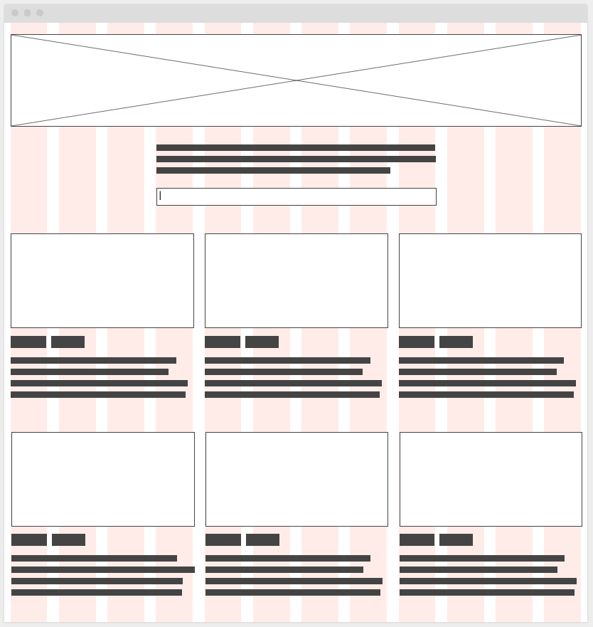

## Desafio BeerTech Talents - Aula4

Analisem a imagem abaixo, este wireframe representa um site de busca e reserva de hotéis em todo mundo, tome-se base um site como [Booking](https://www.booking.com/]).

Ele terá as seguintes funcionalidades: 

1. Ao abrir o site a exibição de Hoteis parceiros reconhecendo a localização atual da pessoa acessante.
2. Ter um campo de busca onde ao digitar palavras chaves como "New York, central park"
3. A busca deverá ler o texto digitado e repassar para a api que deve retornar uma lista de sugestões em dropdown
4. Após a seleção da sugestão os cards de hoteis deverá atualizar para as sugestões de hoteis da região
5. A apresentação de cards dos hoteis deverá possibilitar paginação

Debatam entre vocês quais elementos, classes, funções, ferramentas deverão ser usadas no projeto, detalhem os componentes visuais e seus eventos, pode ser feito um desenho, ou até mesmo escrito, definindo quais elementos vocês julgam importantes ter neste projeto frontend.

Exemplos de perguntas importantes:
- Como será a padronização de código?
- Quais libs/ferramentas serão usadas?
- Quais pontos podem sofrer mudanças e como adaptar?
- Quais componentes visuais existirão?
- Como será a interação entre Frontend e Backend?
