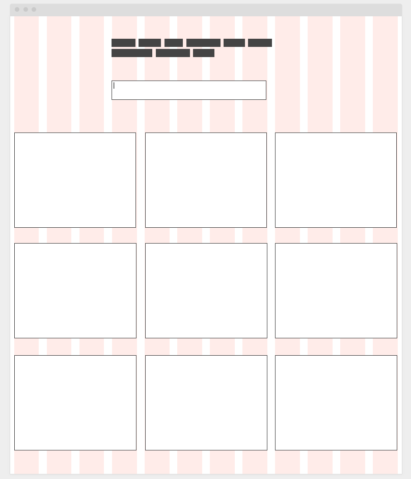

## Desafio BeerTech Talents

### Atividade para ser feita em grupo

Façam a organização do desenvolvimento definindo as tarefas em si para que todos possam participar da criação do desafio:

Dado a estrutura já pronta usando React com Typescript, analisem o retorno do component ```APIService``` o método getUsers retorna via API uma lista de usuários.

Usando o projeto em React criem os componentes em classes tipadas para fazer a exibição dos cliente no documento.

Abaixo segue uma lista de atividades a serem desenvolvidas:

1. Recuperar os dados dos usuários
2. Montar um componente React que irá coloca-los no estado
3. Distribuir esses clientes em cards components
4. No card colocar os detalhes dos cliente(id, nome, email, etc...)
5. Criar um campo de busca em texto que dispara ao digitar a busca
6. Fazer o filtro dos cards da busca por clientes
7. Faça a estilização do projeto (simples CSS ou algum Framework que preferirem)

Abaixo um wireframe base de uma sugestão de posicionamento dos elementos:

